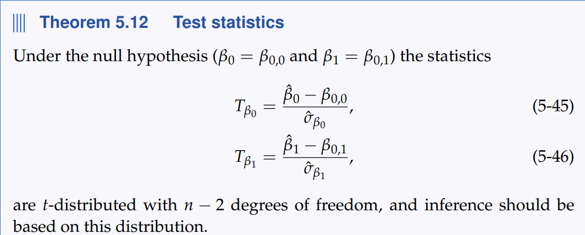
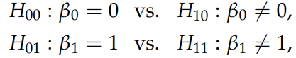

```{r setup, include=FALSE}
knitr::opts_chunk$set(echo = TRUE)
```


```{r}
x <- "168 161 167 179 184 166 198 187 191 179"
xi <- as.numeric(strsplit(x, " ")[[1]])
x <- "65.5 58.3 68.1 85.7 80.5 63.4 102.6 91.4 86.7 78.9"
yi <- as.numeric(strsplit(x, " ")[[1]])

xbar <- mean(xi)
ybar <- mean(yi)

sxx <- sum((xi - xbar)^2)

B1hat <- sum((yi - ybar)*(xi - xbar)) / sxx
B0hat <- ybar - B1hat*xbar

print(c(B1hat,B0hat))
```


```{r}
fit <- lm(yi ~ xi)

B0hat <- coef(fit)[1]
B1hat <- coef(fit)[2]

e <- yi - (B0hat + B1hat*xi)
RSS <- sum(e^2)
n <- length(xi)
df <- n - 2

sigma <- sqrt(RSS / (df))
sigma.B1 <- sqrt( sigma^2/sxx )
sigma.B2 <- sqrt( sigma^2/n + sigma^2*xbar^2 / sxx )
c(sigma, sigma.B1, sigma.B2)
```




Vi tester: 



```{r}
B0 <- coef(fit)["(Intercept)"]
B1 <- coef(fit)[2]

```
