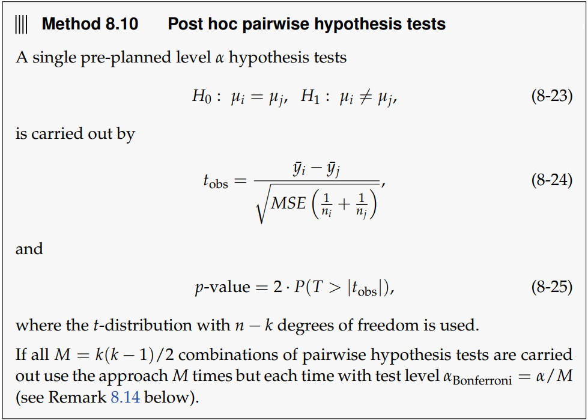

# One-way anova

## post hoc comparison

### Confidence interval

{width="501"}

```{r}
ya <- -0.5416667
yb <- -0.6816667 
a <- 0.05
a_after_bon <- a/1
MSE <- 0.16207
ni <- 6
nj <- 6
df <- 25 -4
(difference <- ya -yb)
interval <- 1-(a_after_bon/2)
fordelling <- qt(0.975, df)
sqroot <- sqrt(MSE*((1/ni)+(1/nj))
sqrt(MSE*((1/ni)+(1/nj)))
difference + c(-1, 1)*plus_minus

```

### Post hoc pairwise hypothesis test

{width="512"}
