(!) = skal testes om den er true

! = mangler eksempel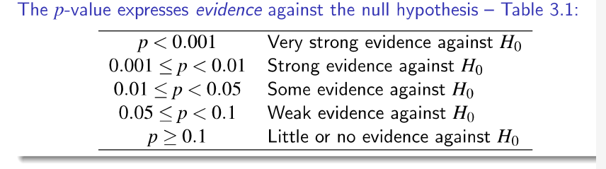

```{r}
x <- "3.7 1.9 4.8 11.7 2.8 4.7 2.7 4.9 6.7 3.8"
lifetime <- as.numeric(strsplit(x, " ")[[1]])
```

# 1 sample data

## CI

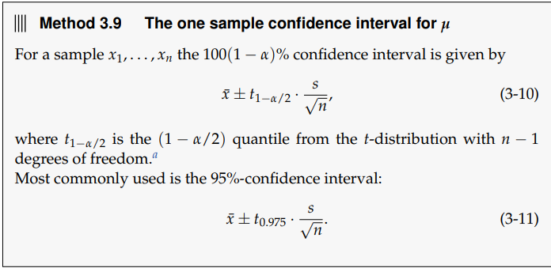

```{r}
n <- 22
mu <- 0
mean <- -0.1181818
sd <- 0.05884899

qt_scale <- qt(0.975, n-1) * sd/sqrt(n)
mean + c(-1,1)*qt_scale

```

## pval

```{r}
n <- 14
mu <- 0
mean <- 367.2
sd <- 571.5
tobs <- (mean-mu)/(sd/sqrt(n))
2*(1-pt(tobs, n-1))
```

## CI for var/sd

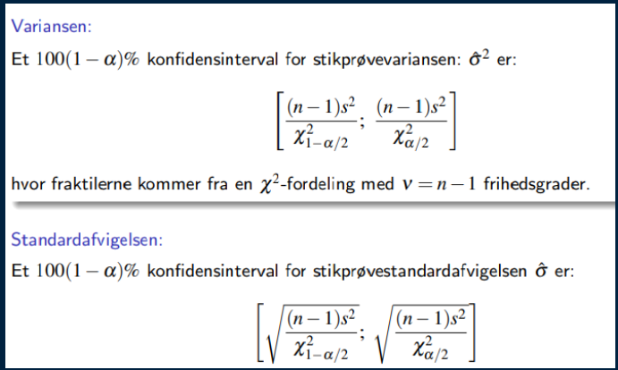

```{r}
n <- 22
mu <- 0
mean <- -0.1181818
s <- 0.05884899

chiout <- qchisq(0.975, n-1)
chiin <- qchisq(0.025, n-1)
#var
var_ci <- (n-1)*(s^2) * c(chiout^-1,chiin^-1)

#sd
sd_ci <- sqrt(var_ci)
sd_ci
```

## Which sample size to choose?

### ME - simple men med shortcomings

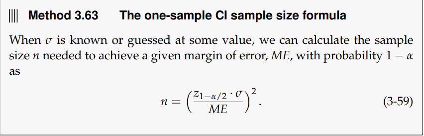

```{r}
ME <- 3
x.sd <- 12.21
# norm dist
z.quantile <- qnorm(0.975)
(n <- ((z.quantile*x.sd)/ME)^2 )
"so n = 64 if int" 
```

### Power - advanced men better

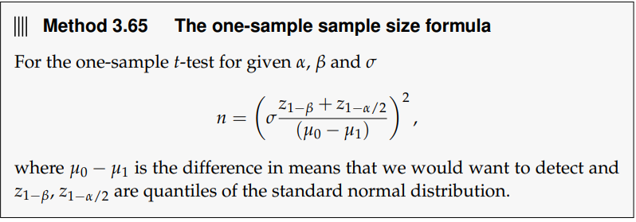 Manuelt

```{r}

z.quantb <- qnorm(0.80)
z.quanta <- qnorm(0.975)
sd <- 12.21
diff <- 4

(n = (sd* (z.quantb + z.quanta)/diff) ^2 )


```

med r direkte

```{r}
#power: 80% chance for at accep den hvis den er true
# a = sig.level
# delta, den diffrence i mean vi vil kunne se forskell på. Relevant fordi vi kigger på difference
# Den her er mere accurate da den bruge t-dist
power.t.test(power=0.8, delta=4, sd=12.21, sig.level=0.05, type="one.sample")

```

# two sample data

## CI for difference

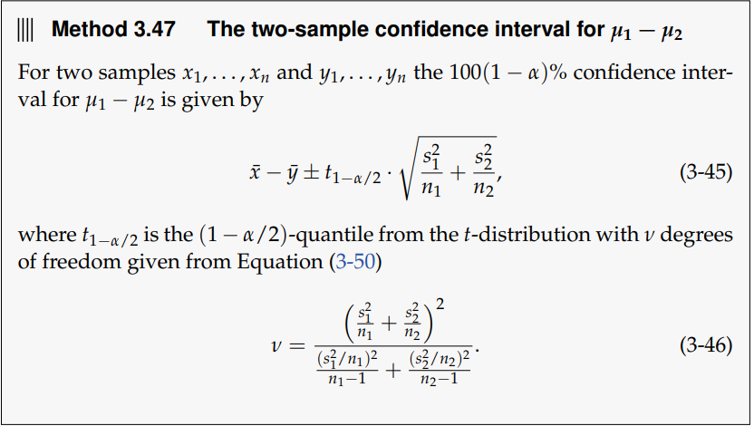

```{r}
xA <- c(7.53, 7.48, 8.08, 8.09, 10.15, 8.4, 10.88, 6.13, 7.9)
xB <- c(9.21, 11.51, 12.79, 11.85, 9.97, 8.79, 9.69, 9.68, 9.19)

A.mean <-  mean(xA)
B.mean <-  mean(xB)
A.len <- length(xA)
B.len <- length(xB)
A.sd <- sd(xA)
B.sd <- sd(xB)

# df
vs=c(var(xA), var(xB))
ns=c(length(xA), length(xB))

v <- ((vs[1]/ns[1]+vs[2]/ns[2])^2)/((vs[1]/ns[1])^2/(ns[1]-1)+(vs[2]/ns[2])^2/(ns[2]-1))

t.quantile <- qt(0.975, v)
change.t <- sqrt( ((A.sd)^2/A.len) + ((B.sd)^2/B.len) )
A.mean-B.mean + c(-1,1)*t.quantile*change.t
c(A.mean,B.mean,t.quantile,change.t)
```

```{r}
# Eller direkte
t.test(xA,xB)
```

## Welch two sample t-test statistic

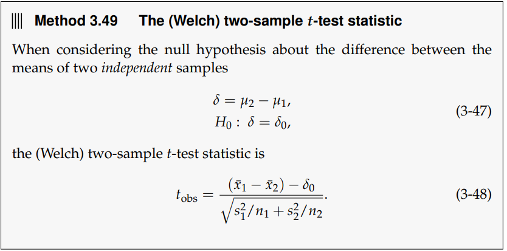

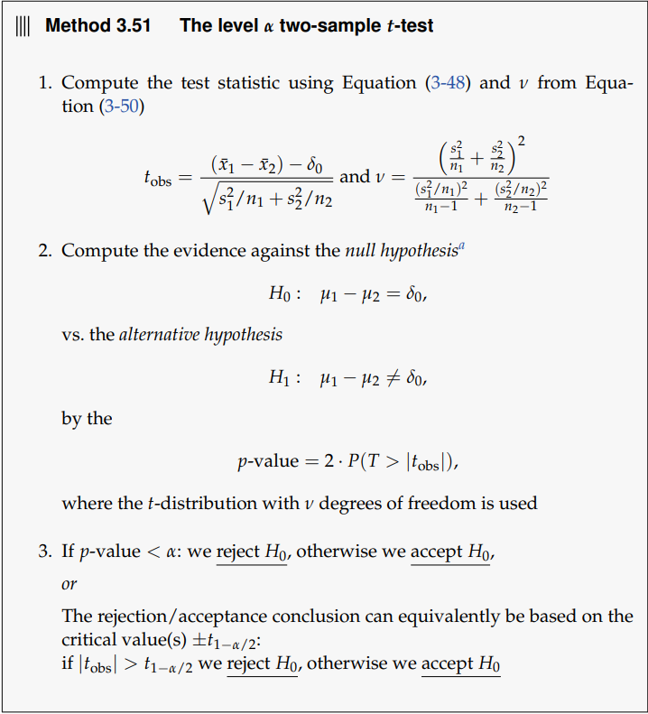

```{r}
xA <- c(7.53, 7.48, 8.08, 8.09, 10.15, 8.4, 10.88, 6.13, 7.9)
xB <- c(9.21, 11.51, 12.79, 11.85, 9.97, 8.79, 9.69, 9.68, 9.19)

ms=c(mean(xA), mean(xB))
vs=c(var(xA), var(xB))
ns=c(length(xA), length(xB))

# Test statistic
tobs <- (ms[2]-ms[1])/sqrt(vs[1]/ns[1]+vs[2]/ns[2])

# Degrees of freedom
v=((vs[1]/ns[1]+vs[2]/ns[2])^2)/((vs[1]/ns[1])^2/(ns[1]-1)+(vs[2]/ns[2])^2/(ns[2]-1))
c(tobs,v)

#Pval
(pval <- 2*(1-pt(tobs, v)) )
#CritVal
(critval <- qt(0.975, v))
```

```{r}
# Direkte
t.test(xA, xB)
```

## Power/sample in two way

```{r}
# Finding the sample size for detecting a group difference of 2
# with sigma=1 and power=0.9
# Her har vi ikke type = "one.sample" på
power.t.test(power=0.90, delta=2, sd=1, sig.level=0.05)

# udfra hvad du giver den, regner den noget forskelligt eg
# Finding the sample size for detecting a group difference of 2
# with sigma=1 and power=0.9
power.t.test(power=0.90, delta=2, sd=1, sig.level=0.05)

```

## Pooled varance/sd

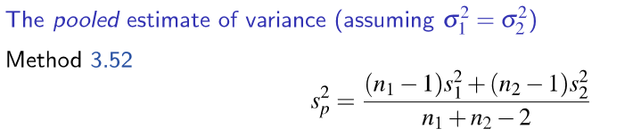

```{r}
v1 <- 1.8^2
n1 <- 20
v2 <- 1.4^2
n2 <- 30
var <- ((n1-1)*v1+(n2-1)*v2) / (n1 + n2 -2)
sigma <- sqrt(var)
```

# anova test

## One-way anova

```{r}
D <- data.frame(strength=c(44.6, 52.8, 53.1, 51.5, 48.2, 50.5, 58.3, 50.0, 53.7, 40.8,
46.3, 55.4, 54.4, 50.5, 44.5, 48.5, 57.4, 55.3, 54.4, 43.9,
45.2, 58.1, 50.6, 47.5, 45.9, 52.3, 54.6, 53.4, 47.8, 42.5),
plastictype = factor(rep(1:5,6))
)

fit <- lm(strength ~ plastictype, data=D)
an <- anova(fit)
an

```

### POST hoc pairwaise CI

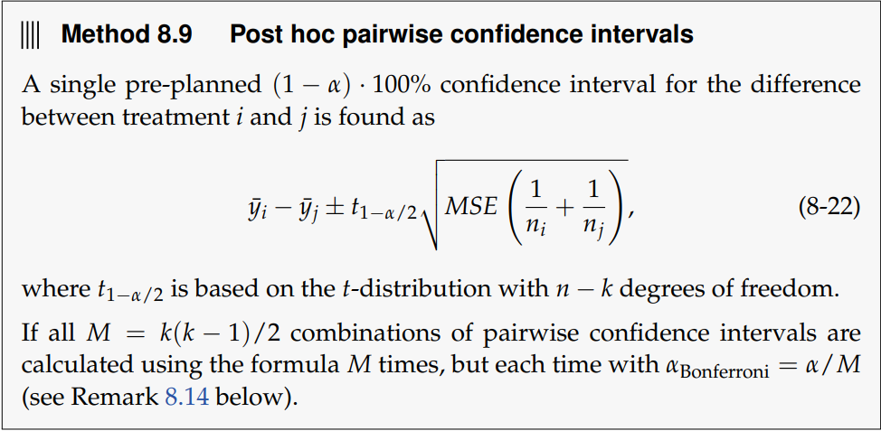{width="501"}

```{r}
rm(list = ls())
a.mean <- -0.5416667
b.mean <- -0.6816667 

an <- 10
bn <- 10
n <- 25
k <- 4
df <- n-k

a <- 0.05/1
mse <- 0.16207

mean.dif <- an - bn

t.quant <- qt(1-(a/2), df)
inner <- mse * ((1/an) + (1/an))
scale <- sqrt(inner)

mean.dif + c(-1,1)*t.quant*scale

```

### LSD values - samme antal obs

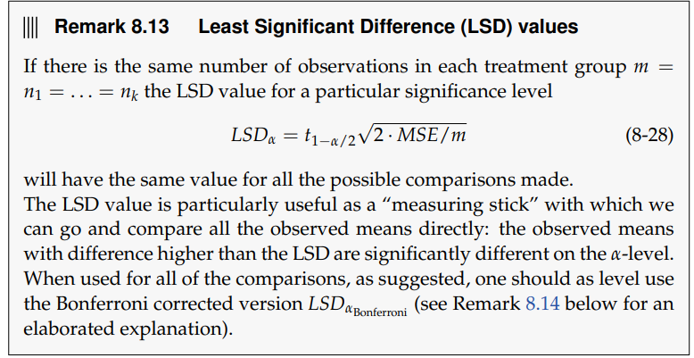

```{r}

m <- 2  # Antal obs i hver kategory

mse <- 0.16207
ny_alpha = 0.005
n <- 10
k <- 2

LSD <- qt(1-(ny_alpha/2), n-k)*sqrt(2*mse*(1/m))
LSD
```

## Post hoc hypothesis test

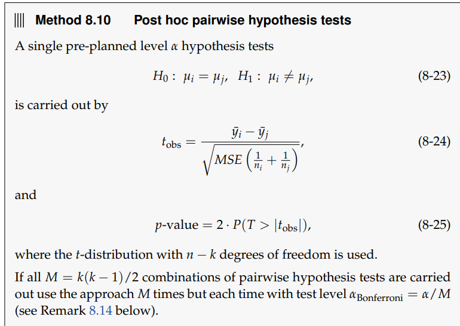

```{r}
rm(list = ls())
a.mean <- -0.5416667
b.mean <- -0.6816667 

an <- 10
bn <- 10
n <- 25
k <- 4
df <- n-k

a <- 0.05/1
mse <- 0.16207
mean.dif <- a.mean - b.mean

t.obs <- mean.dif/ sqrt(mse*((1/an)+ (1/bn)))
t.obs

pval <- 2* (1- pt(t.obs, df))

```

## Two way ANOVA

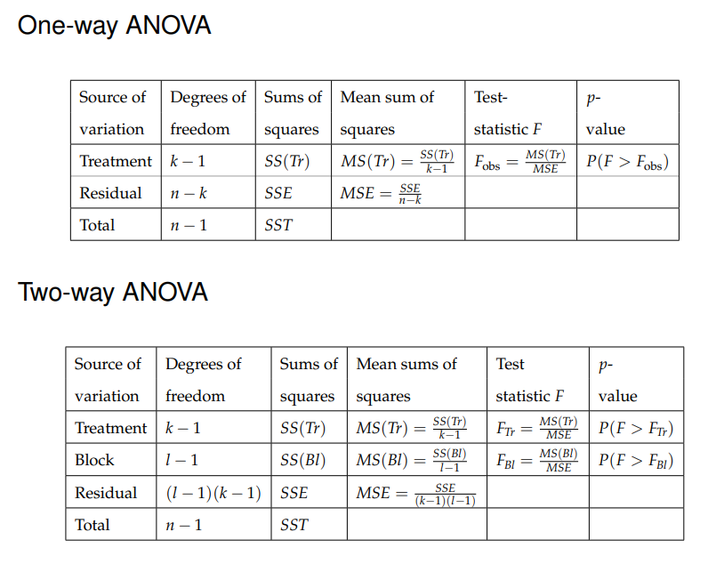

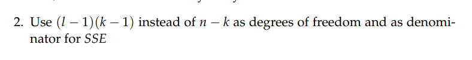

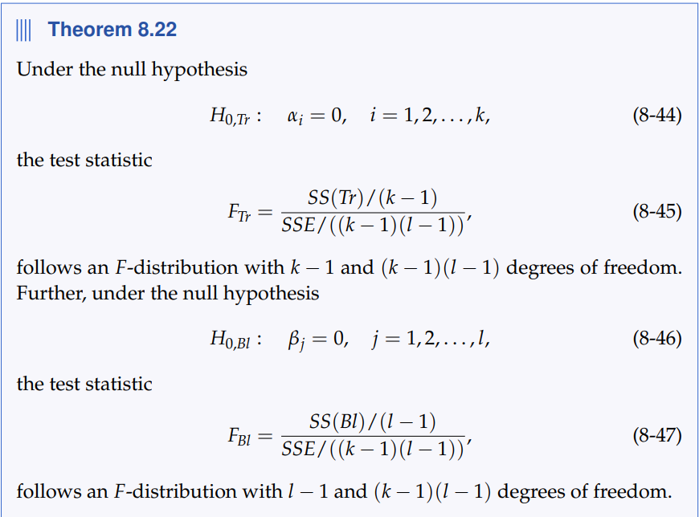

testen laves som pval = 1-pf(fobs, l-1, (k-1)(l-1)

## Anova test

```{r}
y <- c(3.5, 3.0, 5.4, 7.2,
       7.7, 9.0, 7.0, 6.0,
       0.4, 1.1, 1.0, 1.8)
treatm <- as.factor(c(1, 1, 1, 1,
                      2, 2, 2, 2,
                      3, 3, 3, 3))
block <- as.factor(c(1, 2, 3, 4,
                     1, 2, 3, 4,
                     1, 2, 3, 4))

fit <- lm(y ~ treatm + block)
anova(fit)
```

## Find sd

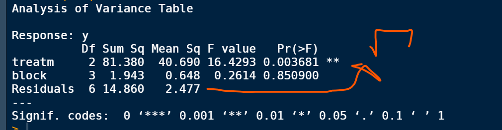

## estimation of parameters

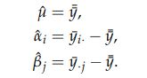

```{r}
y <- c(3.5, 3.0, 5.4, 7.2,
       7.7, 9.0, 7.0, 6.0,
       0.4, 1.1, 1.0, 1.8)
treatm <- as.factor(c(1, 1, 1, 1,
                      2, 2, 2, 2,
                      3, 3, 3, 3))
block <- as.factor(c(1, 2, 3, 4,
                     1, 2, 3, 4,
                     1, 2, 3, 4))
tapply(y, block, mean)
3.866667-mean(y)
```

# PROPORTION analysis

## 1 population proportion analysis

### CI

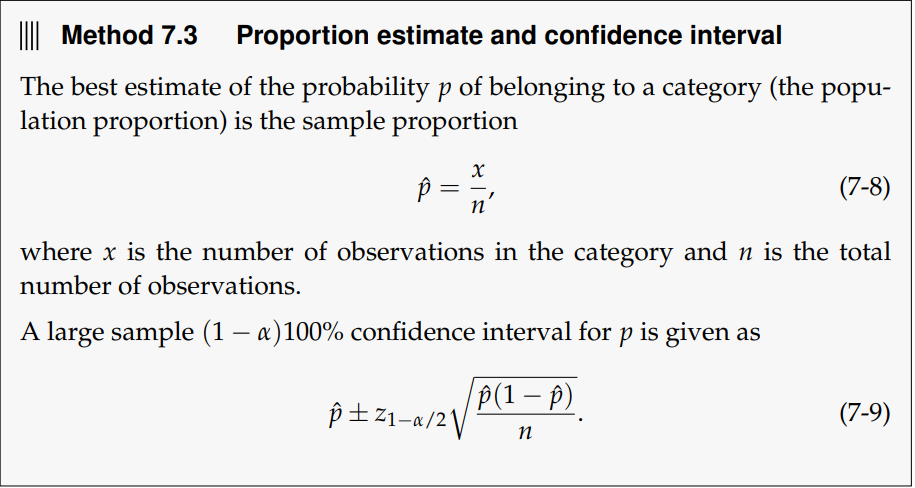 small size er når:

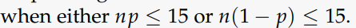{width="297"}

```{r}
x <- 518
n <- 1154
p.hat <- x/n
z.quantile <- qnorm(0.975)
scale <- sqrt(((p.hat*(1-p.hat))/n))
p.hat + c(-1,1) * z.quantile * scale
scale
```

```{r}
prop.test(518,1154,correct = FALSE)
```

### hypothesis test

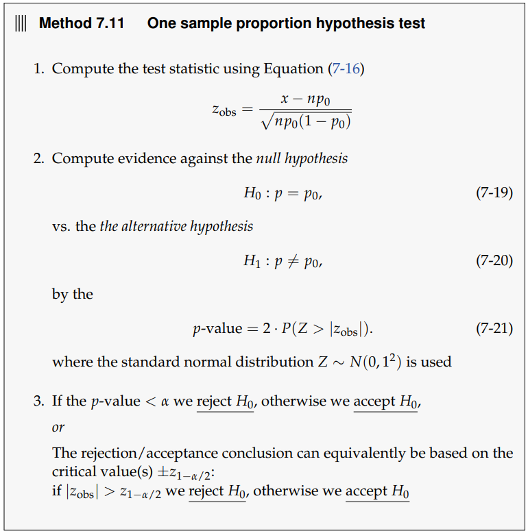

```{r}
x <- 518
n <- 1154
p.hat <- x/n
# Test statistic
# is 0.5 the true proportion?
p0 <- 0.5
zobs <- (x - n*p0) / sqrt(n*p0*(1-p0))

# Husk abs a zobs
p.val <- 2 * (1-pnorm(abs(zobs)))
p.val
```

```{r}
prop.test(518,1154,correct = FALSE)
```

### ME !

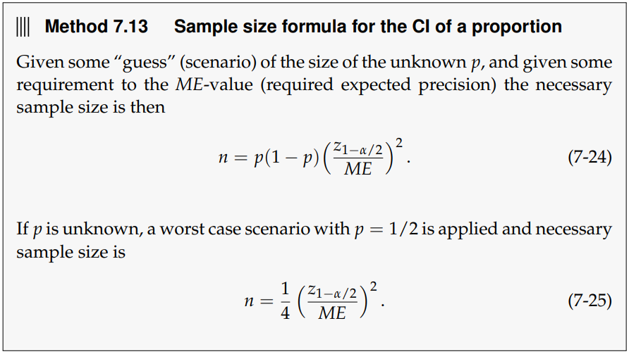

```{r}
p <- 0.04
ME <- 0.01
(n=p*(1-p)*(qnorm(0.975)/ME)^2)

```

## Two proportions

### CI og sd/var !

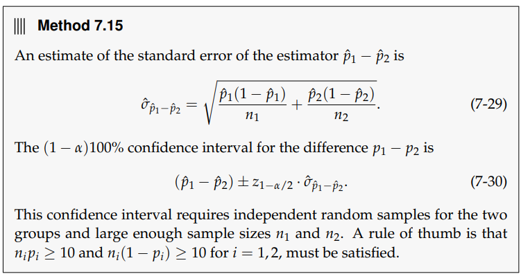

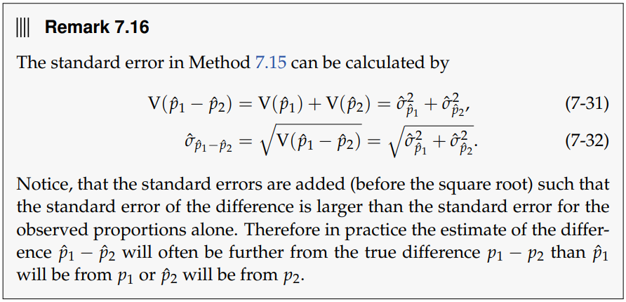

```{r}
p1 <- 26/189
p2 <- 11/157
n1 <- 189
n2 <- 157
sigma_p1_p2 <- sqrt( (p1*(1-p1)/n1) + (p2*(1-p2)/n2) )

p1-p2 + c(-1,1)*sigma_p1_p2*qnorm(0.975)
```

### Hypothesis test !

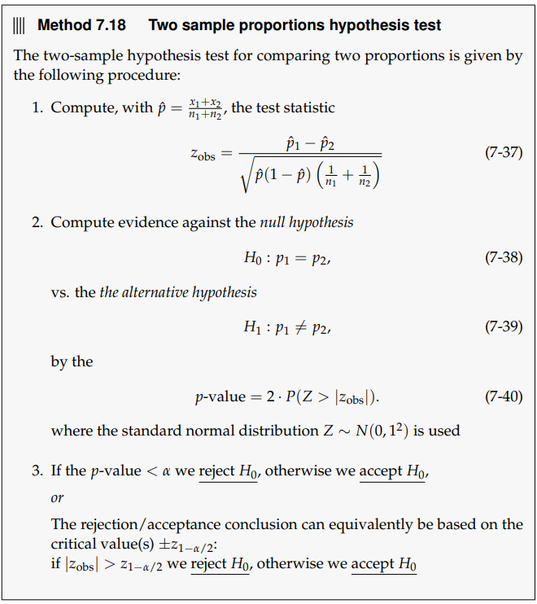

```{r}
x1 <- 31+36
x2 <- 31+30
n1 <- 189
n2 <- 175
p <- (x1+x2)/(n1+n2)
p1 <- x1/n1
p2 <- x2/n2

zobs <- (p1-p2)/sqrt(p*(1-p)*(1/n1+1/n2))
```

```{r}
prop.test(x=c(23,35), n=c(57,167), correct=FALSE, conf.level=0.99)
```

## Multi sample ! på en axis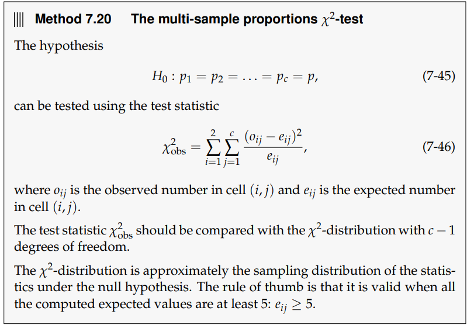

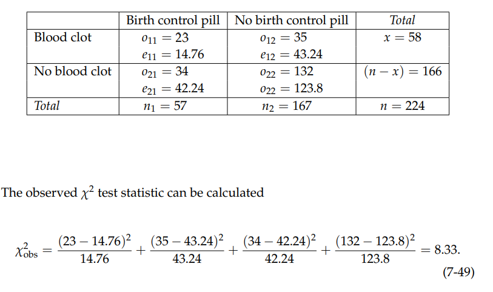

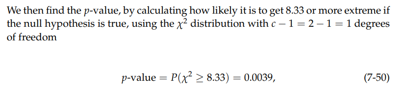

```{r}
pill.study <- matrix(c(23, 35, 34, 132), ncol = 2, byrow = TRUE)
rownames(pill.study) <- c("Blood Clot", "No Clot")
colnames(pill.study) <- c("Pill", "No pill")
chi <- chisq.test(pill.study, correct = FALSE)
#X-squared er test statistic (?)
chi
chi$expected
```

## Multisample på begge

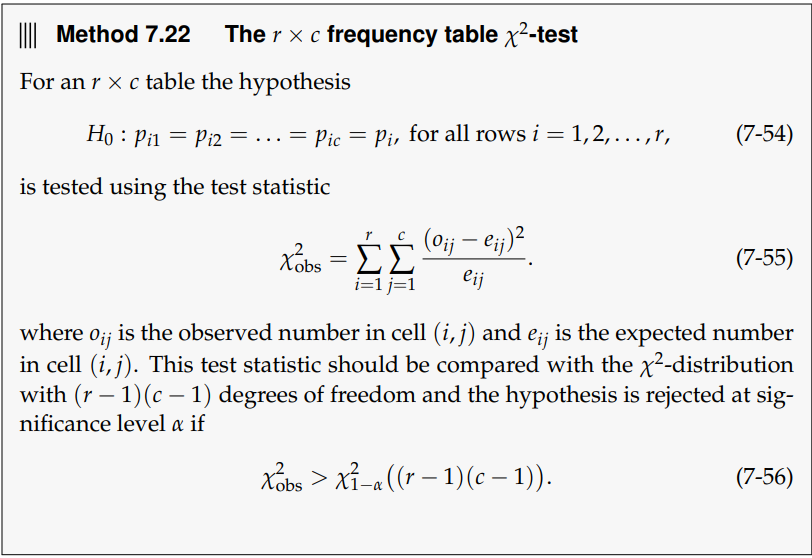

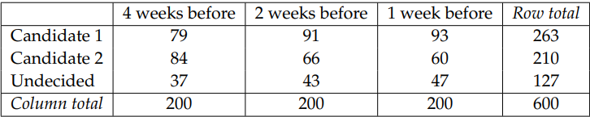

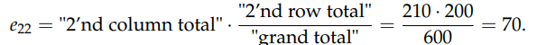

```{r}
mat <- matrix(c(24, 21, 14,
                12, 15, 22,
                15, 26, 24), ncol = 3, byrow = TRUE)
colnames(mat) <- c("Low","Medium","High")
rownames(mat) <- c("A","B","C")

mat <- as.data.frame(mat)

test <- chisq.test(mat, correct = FALSE)
test$expected
```

Her er contribution af en

```{r}
e <- 344*189/662
o <- 96
(e-o)^2 / e

```

# Simulation methods

## Bootstrapping

# normal LR

### CI for parametre

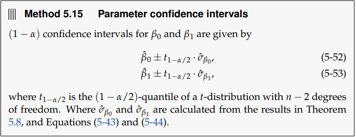

```{r}
B1 <- 23.25
tquant <- qt(0.975, 18)
B1.sigma <- 1.74
B1 + c(-1,1)*tquant*B1.sigma
```

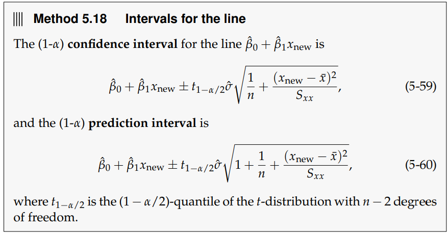 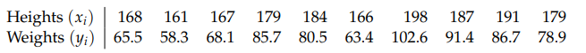

```{r}

b0 <- -120
b1 <- 1.113
xnew <- 200

mean <- 178
n <- 10
df <- n-2
sd <- 3.88
sxx <- 1342

"CI:"
tquantile <- qt(0.975, df)
scale <- sd * sqrt(1/n + (mean - xnew)^2/sxx )
b0+b1*xnew + c(-1, 1)*tquantile*scale

"Prediction Interval:"
tquantile <- qt(0.975, df)
scale <- sd * sqrt(1 + 1/n + (mean - xnew)^2/sxx )
b0+b1*xnew + c(-1, 1)*tquantile*scale
```

```{r}
# Direkte med r
y <- c(8.43, 7.89, 8.28, 7.84, 9.62, 9.41, 9.40, 8.22, 9.18, 9.17,
9.25, 9.68, 8.49, 8.53, 9.30, 8.94, 9.46, 9.69, 9.37, 9.42,
9.13, 9.18)
x <- year <- 1984:2005
fit <- lm(y ~ x)

newdata <- data.frame(x = 2017)
predict(fit, newdata=newdata, interval="confidence",
level=0.95)
predict(fit, newdata=newdata, interval="prediction",
level=0.95)

```

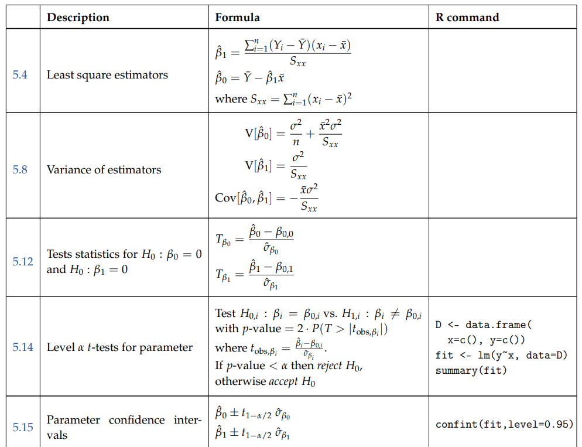

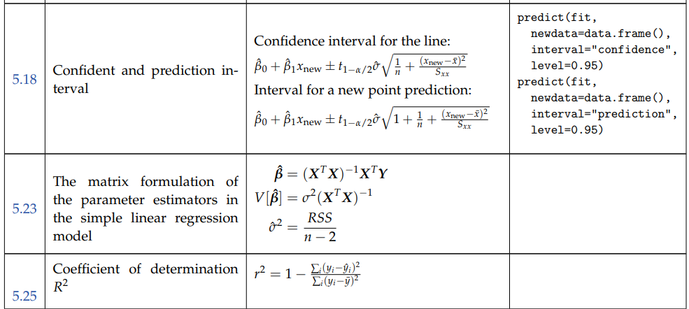

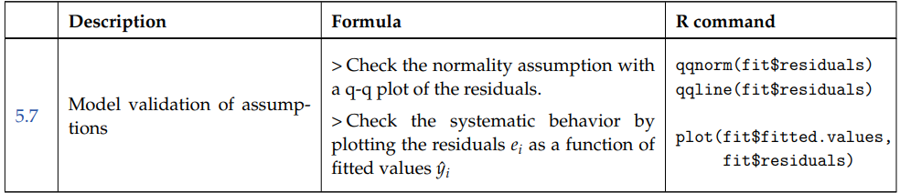

# MLR

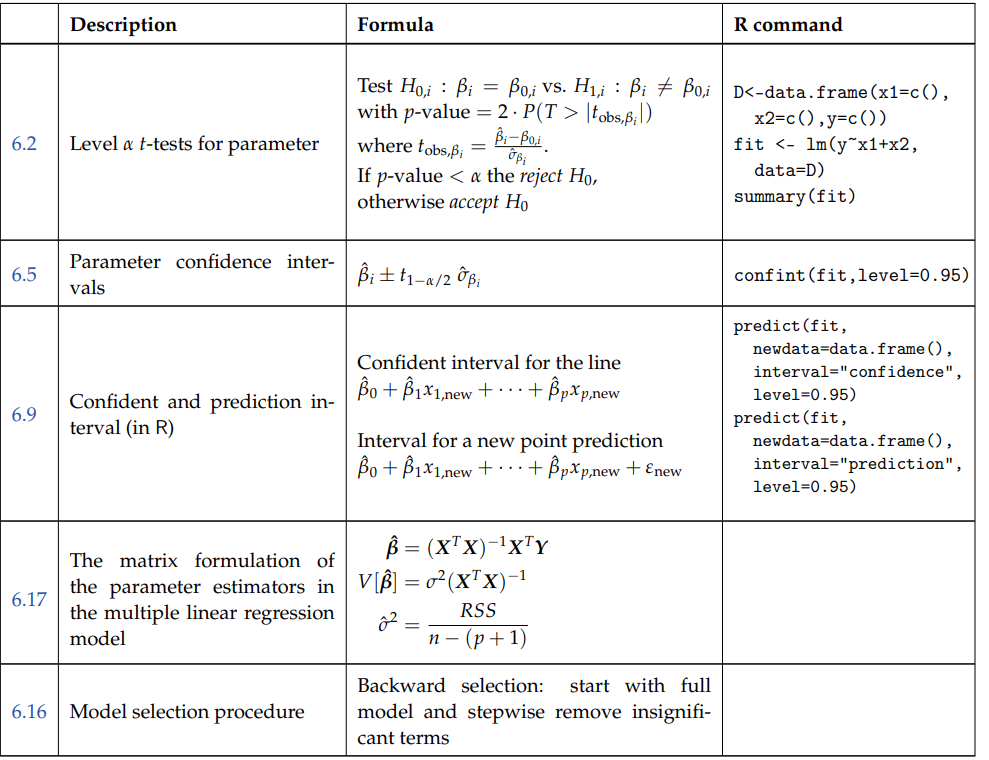
